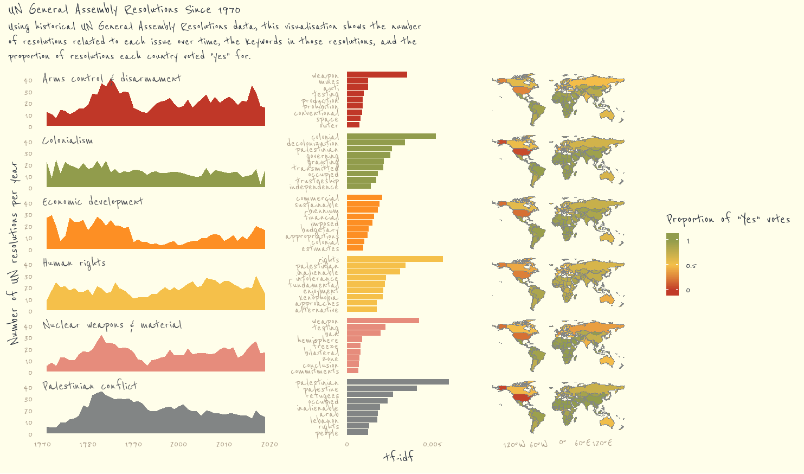

```{r setup, include=FALSE}
knitr::opts_chunk$set(echo = FALSE, 
                      message = FALSE,
                      include = TRUE, 
                      warning = FALSE)
```

```{r load_libraries, include=FALSE}

library(tidytuesdayR)
library(ggplot2)
library(tidyverse)
library(sf)
library(rnaturalearth)
library(patchwork)
library(scales)
library(ggthemes)
library(viridis)
library(ggtext)
library(extrafont)
library(hrbrthemes)
library(lubridate)
library(forcats)
library(showtext)
library(glue)
library(scales)
library(tidytext)
library(countrycode)

library(silgelib)

extrafont::loadfonts(quiet = TRUE)

theme_set(theme_plex())

font_add_google("IBM Plex Sans", "IBMPlexSans")
#font_add_google('Reenie Beanie', 'Reenie Beanie')

showtext_auto()

```

## Download Data

```{r echo=TRUE}
tuesdata <- tidytuesdayR::tt_load(2021, week = 13)

unvotes <- tuesdata$unvotes
issues <- tuesdata$issues
roll_calls <- tuesdata$roll_calls

glimpse(unvotes)
glimpse(issues)
glimpse(roll_calls)
```

## EDA

Determine which country abstains the most in UN Votes

```{r echo=TRUE}
abstain_top10 <- unvotes %>% 
    count(country, vote) %>% 
    filter(vote == "abstain") %>% 
    slice_max(n = 10, order_by = n) %>% #Use sclice_max to order data
    # arrange(desc(n)) %>% 
    # slice(1:10) %>% 
    ggplot(aes(n, fct_reorder (country, n), label = n)) +
    geom_col(fill = "skyblue") + 
    geom_text(hjust = 1.3) +
    
    labs(x = "", y = "", 
         title = "Countries with the most Abstain Votes", 
         subtitle = "Top 10") +
    
    theme_ipsum_ps() + 
    
    theme(
        plot.title = element_text(family = "IBMPlexSans", face = "bold"), 
        axis.title.x=element_blank(),
        axis.text.x=element_blank(),
        axis.ticks.x=element_blank()
    )

abstain_top10
```

Determine the Least Agreeable Countries

```{r echo=TRUE}

least_agreeable_top10 <- unvotes %>% 
    count(country, vote) %>% 
    filter(vote == "no") %>% 
    arrange(desc(n)) %>% 
    slice(1:10) %>% 
    ggplot(aes(n, fct_reorder (country, n), label = n)) +
    geom_col(fill = "skyblue") + 
    geom_text(hjust = 1.3) +
    
    labs(x = "", y = "", 
         title = "Top 10 Least Agreeable Countries", 
         subtitle = "Countries that vote 'No' the most") +
    
    theme_ipsum_ps() + 
    
    theme(
        plot.title = element_text(family = "IBMPlexSans", face = "bold"), 
        axis.title.x=element_blank(),
        axis.text.x=element_blank(),
        axis.ticks.x=element_blank()
    )

least_agreeable_top10

```

Determine the most Agreeable Countries

```{r echo=TRUE}
most_agreeable_top10 <- unvotes %>% 
    count(country, vote) %>% 
    filter(vote == "yes") %>% 
    # arrange(desc(n)) %>% 
    # slice(1:10) %>% 
    top_n(10) %>% #Use top_n to replace arrange and slice
    ggplot(aes(n, fct_reorder (country, n), label = n)) +
    geom_col(fill = "skyblue") + 
    geom_text(hjust = 1.3) +
    
    labs(x = "", y = "", 
         title = "Most Agreeable Countries", 
         subtitle = "Top 10") +
    
    theme_ipsum_ps() + 
    
    theme(
        plot.title = element_text(family = "IBMPlexSans", face = "bold"), 
        axis.title.x=element_blank(),
        axis.text.x=element_blank(),
        axis.ticks.x=element_blank()
    )

most_agreeable_top10
```

Combining all 3 plots

```{r echo=TRUE}

abstain_top10 | least_agreeable_top10 / most_agreeable_top10
```

## Joining All Datasets

```{r echo=TRUE}
combined_dataset <- unvotes %>% 
    inner_join(issues, by = "rcid") %>% 
    inner_join(roll_calls, by = "rcid")
```

What Issues Drive Important Votes

```{r echo=TRUE}
combined_dataset %>% 
    filter(importantvote == 1) %>% 
    count(issue) %>% 
    ggplot(aes(n, fct_reorder(issue,n), label = n)) +
    geom_col(fill = "skyblue") + 
    geom_text(hjust = 1.3) +
    labs (x = "", y = "",
        title = "Issues that Dominate Important Vote Gatherings"
    )+ 
    theme_ipsum_ps() +
    
    theme(
        plot.title = element_text(family = "IBMPlexSans", face = "bold"), 
        axis.title.x=element_blank(),
        axis.text.x=element_blank(),
        axis.ticks.x=element_blank()
    )
```

How has category of issues voted on changed since 1940

```{r echo=TRUE}
combined_dataset %>% 
    mutate(year = year(date), 
           year = factor(year - year %%  10 )) %>% 
    count(year, issue) %>% 
    ggplot(aes(year, n, fill = issue)) +
    geom_col(position = "dodge") +
    labs(x = "", 
         y = "Vote Tally",
         fill = "",
         title = "Busy 1980s", 
         subtitle = "The UN was terribly busy in the 1980s as there was an escalation in Arms Control issues and Palestinian Conflict") + 
    scale_fill_manual(values =  c("#f98866", "#ff420e", "#80bd9e", "#89da59", "#90afc5", "#336b87"
) ) + 
    theme_ipsum_ps() + 
        theme(
        plot.title = element_text(family = "IBMPlexSans", face = "bold"), 
    )
    
```

How often does USA, China and Russia agree or disagree

```{r}
combined_dataset %>% 
    filter(country %in%  c("United States", "Russia", "China"))
    
    
```

Sarina Singh Khaira's Analysis

<https://github.com/sarinasinghkhaira/tidy_tuesday/blob/main/2021-03-23_UN_Votes/UN_votes_plot.Rmd>

```{r}

prop_yes <- combined_dataset %>% 
    #clean up coountries names not recognized by countrycode
    mutate(country = case_when(str_detect(country, "Yemen") ~ "Yemen", 
                            str_detect(country, 'German') ~ "Germany", 
                            TRUE ~ country)) %>% 
    filter(year(date) > 1990) %>% 
    group_by(country, issue) %>% 
    summarise(total_votes = n(), 
              prop_yes = mean(vote == "yes")) %>% 
    mutate(country_code = countrycode(country, origin = "country.name", destination = "iso3c")) %>% 
    filter(!is.na(issue)) %>% 
    drop_na(country_code)


```

Generate A world Map

```{r}
world <- ne_countries(scale = "small", returnclass = "sf")
```

\#plot proportion of yes votes by country as a chloropleth

```{r}
library(ggpomological)
library(sf)
 
st_crs(world) <- 4326
world

map <- world %>%
  # join unvotes data to spatial data
  left_join(prop_yes, by = c("brk_a3" = "country_code")) %>%#
  # remove resolutions not assigned to an issue
  filter(!is.na(issue)) %>%
  ggplot() +
  geom_sf(aes(fill = prop_yes), size = 0.1, colour = "#828585") +
  # change map projection
  coord_sf(crs = 4326) +
  # set colour scale
  scale_fill_gradient2(low = "#c03728", mid = "#f5c04a", high = "#919c4c", midpoint = 0.5, 
                       name = "Proportion of \"Yes\" votes", 
                       guide = "colourbar", 
                       breaks = c(0.01, 0.5, 1), labels = c("0", "0.5", "1")
                      ) +
  guides(fill = guide_colourbar(title.position="top", title.hjust = 0, nbin = 5)) +
  scale_color_pomological(guide = F) +
  theme_pomological(base_family = "Reenie Beanie", base_size = 20) +
  theme(axis.text = element_blank(),
        strip.text = element_blank(),
        legend.position = "bottom",
        legend.box.spacing = unit(-1, 'cm'),
        legend.margin = margin(0, 0, 0, 0, "cm"),
        panel.spacing.y = unit(1.3, "lines"),
        plot.margin = unit(c(0, -0.5, 0, -2), "lines") #top, right, bottom, left
        ) +
  facet_wrap(~issue, nrow = 6)
```

```{r}
issues_resolutions <- issues %>% 
    left_join(roll_calls, by = "rcid") %>% 
    filter(year(date) > 1970) %>% 
    mutate(issue = recode(issue, "Nuclear weapons and nuclear material" = "Nuclear weapons and material"), 
           issue = str_replace_all(issue, "and", "&"))
```

```{r}

hist <- issues_resolutions %>%
  ggplot() +
  aes(x = year(date)) +
  geom_area(stat = "count", aes(fill = issue), show.legend = F) +
  # add issue titles inside plot area
  geom_text(x = 1970, y = 45, 
            aes(label = issue), 
            data = issues_resolutions %>% distinct(issue), 
            hjust = 0, vjust = 1, 
            family = "Reenie Beanie", size = 7, fontface = "bold", colour = "#4f5157") +
  scale_fill_pomological() +
  theme_pomological(base_family = "Reenie Beanie", base_size = 20) +
  labs(x = "", y = "Number of UN resolutions per year",
       title = NULL) +
  facet_wrap(~issue, nrow = 6) +
  ylim(c(0, 45)) +
  theme(legend.position = "none", 
        panel.spacing.x = unit(2, "lines"),
        strip.text = element_blank(),
        plot.margin = unit(c(0.5, 0.5, 0, 0.5), "cm"), #top, right, bottom, left
        panel.border = element_blank()
        )
```

Text Analysis

Pick out the keywords from the UN resolutions within each issue by calculating tf-idf

```{r}

 # Obtain tf idf for issues
issues_tf_idf <- issues %>%
  left_join(roll_calls, by = "rcid") %>%
  select(issue, descr) %>%
  unnest_tokens(word, descr)  %>% 
  # remove punctuation and amalgamate certain words
  mutate(word = str_remove_all(word, "[[:punct:]]"),
         word = case_when(
           str_detect(word, "test") ~ "testing",
           str_detect(word, "weapon") ~ "weapon",
           str_detect(word, "banning") ~ "ban",
          TRUE ~ word
         )) %>% 
     count(word, issue) %>% 
     bind_tf_idf(word, issue, n) %>% 
     # remove stopwords, numbers
  anti_join(stop_words, by = "word") %>%
  filter(!str_detect(word, "[0-9]"))
```

```{r}
# plot of tf_idf for resolutions under each issue 
tf <- issues_tf_idf %>%
  group_by(issue) %>%
  slice_max(tf_idf, n = 9) %>%
  mutate(word = reorder_within(word, tf_idf, issue)) %>%
  ungroup() %>%
  ggplot() +
  aes(x = tf_idf, y = word, fill = issue) +
  geom_col(show.legend = FALSE) +
  facet_wrap(~issue, scales = "free_y", nrow = 6) +
  scale_fill_pomological() +
  scale_x_continuous(breaks = c(0, 0.005), labels = c(0, 0.005)) +
  theme_pomological(base_family = "Reenie Beanie", base_size = 20) +
  theme(strip.text = element_blank(),
        plot.margin = unit(c(0.5, 0, 0, 1), "cm"), #top, right, bottom, left
        panel.border = element_blank(),
        axis.ticks.x = element_line(colour = "#828585")
        ) +
  scale_y_reordered() +
  labs(y = NULL, 
       x = "tf-idf")
```

Combine plots using patchwork

```{r results='hide'}
plot <- hist|tf|map
```

```{r results='hide'}
library(here)
plot_1<- plot + plot_annotation(
  title = "UN General Assembly Resolutions Since 1970",
  subtitle = str_wrap("Using historical UN General Assembly Resolutions data, this visualisation shows the number of resolutions related to each issue over time, the keywords in those resolutions, and the proportion of resolutions each country voted \"yes\" for.", width = 90) ,
  theme = theme_pomological(base_family = "Reenie Beanie", base_size = 22)) +
  plot_layout(widths = c(1, 0.7, 1.5)) +
  theme(
      panel.border = element_blank(),
        panel.grid = element_blank(),
        strip.background = element_blank(),
        strip.placement = NULL)

plot +  
    plot_layout(ncol = 3, widths = c(1, 0.7, 1.5)) + 
    plot_annotation(
  title = "UN General Assembly Resolutions Since 1970",
  subtitle = str_wrap("Using historical UN General Assembly Resolutions data, this visualisation shows the number of resolutions related to each issue over time, the keywords in those resolutions, and the proportion of resolutions each country voted \"yes\" for.", width = 90)) &
    theme(
          plot.subtitle = element_text(size = 19, family = "Reenie Beanie"),
          plot.title =   element_text(size = 22, family = "Reenie Beanie")) +
 
  theme(panel.border = element_blank(),
        panel.grid = element_blank(),
        strip.background = element_blank(),
        strip.placement = NULL)


```

```{r results='hide'}
plot_3 <- plot + 
    plot_layout( widths = c(1.5, 0.7, 1.2)) + 
    plot_annotation(
        title = "UN General Assembly Resolutions Since 1970",
        subtitle = str_wrap("Using historical UN General Assembly Resolutions data, this visualisation shows the number of resolutions related to each issue over time, the keywords in those resolutions, and the proportion of resolutions each country voted \"yes\" for.", width = 90)) &

  theme_pomological(base_family = "Reenie Beanie", base_size = 22) + 

    theme(
      plot.subtitle = element_text(size = 19, family = "Reenie Beanie"),
      plot.title =   element_text(size = 22, family = "Reenie Beanie")) +


    
    theme(
      panel.border = element_blank(),
        panel.grid = element_blank(),
        strip.background = element_blank(),
        strip.text = element_blank(),
        #legend.position = "bottom",
        strip.placement = NULL) 


```



```{r}

```
